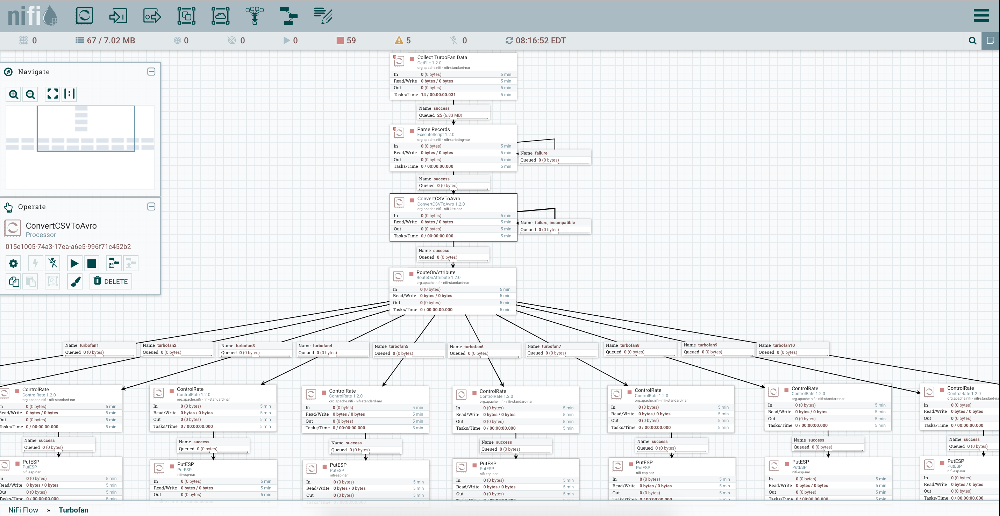

<h3>Turbofan Project</h3>
This project collects, routes, and analyzes turbofan data streams in real-time using <a href="https://docs.hortonworks.com/HDPDocuments/HDF3/HDF-3.0.1.1/bk_getting-started-with-apache-nifi/content/getting-started-with-apache-nifi.html">Apache NiFi</a> and <a href="https://www.sas.com/en_us/software/event-stream-processing.html">SAS Event Stream Processing</a>. 
 
 Data for this project comes from <a href="https://ti.arc.nasa.gov/tech/dash/pcoe/prognostic-data-repository/">NASA's Prognostics Data Repository</a>
 
 NOTE: This project requires a .NAR file (nifi-esp-nar-5.1.nar), which can be downloaded from SAS as part of the SAS ESP Software Depot. The .NAR file needs to be placed in the ./lib path of NiFi. Once the .NAR file is moved to the ./lib path, you should then see a PutESP and ListenESP processor within the browser-based NiFi User Interface.
 
 

 
